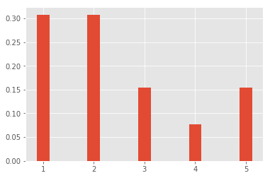

# The Probability Mass Function (PMF)

## Introduction
So far, we have seen a number of visualization and statistical techniques to get an understanding of the behavior of data. We have seen how boxplots, histograms, stem and leaf plots etc., that can be used to identify data features like central tendency and variance/spread and class distribution present in the data. In this lesson we shall look at another way to represent a distribution - a probability mass function (pmf), which maps from each value to its probability.

## Objectives
You will be able to: 
* Develop a mathematical understanding of a discrete variable pmf
* Develop an intuition for pmf while working with a toy example
* Visualize the probability mass function and describe its relationship with histograms

## What is pmf ?

A probability mass function (pmf), sometimes also called just a frequency function gives us probabilities for discrete random variables. We already know that discrete random variables from examples like coin flips and dice rolls etc. The **discrete** part in discrete distributions means that there is a known number of possible outcomes. For example, you can only roll a 1,2,3,4,5, or 6 on a die. **Based on our observations** of all the values from 1 to 6 in a number of dice rolls, we can develop a pmf for the dice showing the probability of each possible value occurring. 

Here is a more formal understanding:

> There is a probability that a discrete random variable X takes on a particular value x, so that P(X = x), denoted as f(x). The function f(x) is typically called the probability mass function, or pmf. 

If X is a discrete random variable then its range R<sub>X</sub> is a countable set of all possible values of X. We can list the elements in R<sub>X</sub> as:

>R<sub>X</sub>={ x1,x2,x3,... }

Where x1,x2,x3 ... are the possible values of X. We are interested in learning if the probability of X = x<sub>k</sub> for some possible value k. 

Think of the event A , such that  A = { X = x<sub>k</sub> } is defined as the set of outcomes s in the sample space S for which the corresponding value of X is equal to x<sub>k</sub>.  This can be written as:

> A = { s ∈ S | X(s) = x<sub>k</sub> }

The probabilities of events **{ X = x<sub>k</sub> }** are formally shown by the probability mass function (pmf) of X.

Thus, the pmf is a probability measure that gives us probabilities of the possible values for a random variable. 


## pmf Intuition

At this stage, some of us may not be able to translate the mathematics above into an intuition. So let's work through a brief example calculating the pmf for a variable. 

We have seen previously that **probability** is a number in the range [0,1] that is calculated as *frequency expressed as a fraction of the sample size.* So this would mean that in order to convert and random variable's frequency into a probability, we need to perform following steps:

* Get the frequency of each possible value in the dataset
* Divide the frequency of each value by the total number of values (length of dataset)
* Get the probability of for each value

Let's show this using a simple toy example:


```python
# Count the frequency of values in a given dataset

import collections
x = [1,1,1,1,2,2,2,2,3,3,4,5,5]
counter = collections.Counter(x)
print(counter)
print (len(x))

```

    Counter({1: 4, 2: 4, 3: 2, 5: 2, 4: 1})
    13


So now we have a dictionary that contains keys showing all possible items, and values of these keys set to the frequency of items. We can simply calculate pmf using step 2 above. 


```python
# Convert frequency to probability - divide each frequency value by total number of values
pmf = []
for key,val in counter.items():
    pmf.append(round(val/len(x), 2))
    
print(counter.keys(), pmf)

```

    dict_keys([1, 2, 3, 4, 5]) [0.31, 0.31, 0.15, 0.08, 0.15]


The pmf is normalized so total probability is 1 as we can check by adding all the values in the pmf list above. 


```python
np.array(pmf).sum()
```


    1.0


## Visualizing pmf

We can inspect pmf of a discrete variable by visualizing it in matplotlib. For this, we can use the leaf plot and have it show the pmf using the probabilities calculated above. We shall see this below:


```python
import matplotlib.pyplot as plt
plt.style.use('ggplot')

plt.stem(counter.keys(), pmf, '-', 'go', 'r-');
plt.title ("A Probability Mass Function");
```





This looks pretty familiar. More like a histogram, but with lines instead of bars. Let's draw a histogram of the data to see if there is any real resembles. 


```python
plt.hist(x);
plt.title('Histogram');
```


The bars look almost the same as the lines above. If you look carefully, the difference is only there in the y-axis. A histogram shows the frequency count of each value in a dataset, whereas a pmf, being a probability function shows the data as probabilities. And this is where we started off from. A pmf ingests frequencies of values and convert them into a function of their probability of occurance of those values. 

**NOTE**: In some literature, the pmf is also called just the **probability distribution**. The phrase distribution function is usually reserved exclusively for the cumulative distribution function CDF. 


## Summary

In this lesson we looked at probability mass function, and how to get a list of probabilities for each possible value in a discrete random variable, by looking at their frequency of occurring. So we bassically moved from a purely frequenstist domain to a more probabilistic domain with these pmfs. Moving on, we'll see another couple of such probabilistic functions for discrete and continuous variables. 
